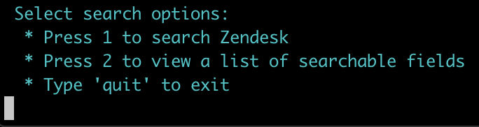
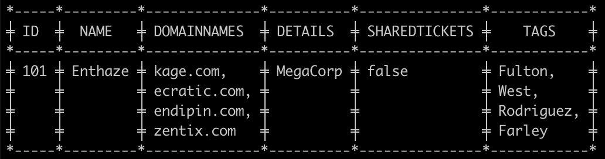

# Search Challenge

A basic CLI app that searches JSON data and outputs the result.

### Caveats

* Only exact matches are supported and search terms are case-sensitive
* Value can be empty if its corresponding key exists
* If the data does not exist, the program will inform accordingly

### Assumptions made

* The content of all the files fit into memory
* Each search command can only be run against one file at a time — you cannot search for a common value across different files unless it is a separate search
* When searching values inside arrays, each value is a separate search

### Tools used

* Go 1.14
* Docker Engine 19.03.8
* Golang 1.14 docker image

### Libraries used

* [Testify](github.com/stretchr/testify) - assertions in unit tests
* [ASCII Table Writer](github.com/olekukonko/tablewriter) - generate ASCII table on the fly

## Getting set up

Clone the app and cd into it so that you're in the root directory.

To run the app inside a Docker container without installing Go:

#### Run tests

```
$ make test
```

#### Run the app

```
$ make run
```

#### Update dependencies

```
$ make update
```

#### Build & run the binary

```
$ make run_binary
```

Note: you will need to set and export the following env vars if you simply run `go run main.go` — find the values in `docker-compose.yml` file
* `USERS_FILE`
* `TICKETS_FILE`
* `ORGANIZATIONS_FILE`

Just hit 'Enter' to clear state and return to the main menu:\


Entering 'help' will always output the main menu:\


Sample search result:\


## Improvements & considerations

* Integration tests would help ensure reliability across overall flow
* Errors should be sent to stderr & outputted to a log file. In a production environment they could be streamed to a third party log monitoring service
* Custom errors should be implemented to separate error types, such as expected errors and unexpected errors, ie. "Results not found" vs "invalid character ':' after array element"
* The search was implemented in O(n) time, however 2 options were considered respectively to get nearer to O(1) runtime:
  * An in-memory cache that stores the search params as key. Each search result is memoized, making the next search with same parameters constant time
  * Preprocess the data and build up an inverted index on app load, so that every string in the data is associated with an index that contains that string ([library considered](https://github.com/blevesearch/bleve))
* The file paths are ideally not stored as relative paths in env vars nor should the files be stored locally. In a production environment, the files could be encrypted and stored in object storage like S3, or mapped to a database for data indexing thus faster retrieval 
* Currently the program is reading an entire file's contents into memory — this could be made more elegant by opening the file, then using the `oi` package for more controlled reading
* Stronger validation is needed on the search params — currently the program cannot tell the difference between wrong format and unsupported values on view type and entity
